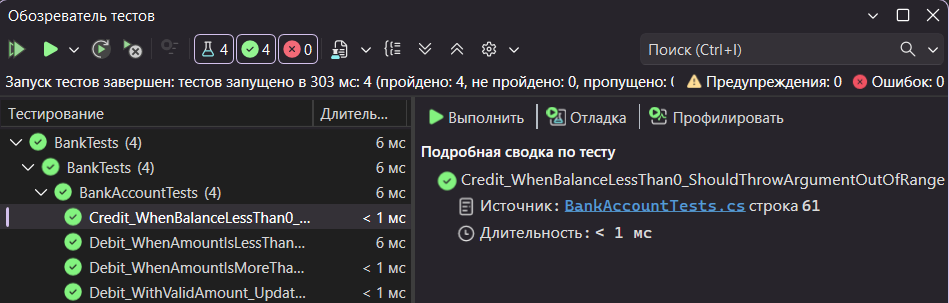

# Практическая работа №6 — Создание автоматизированных Unit-тестов

**Группа:** 3ИСИП-423  
**Студенты:** Трудова Анастасия, Резанцев Артемий

---

## Цель работы

Провести тестирование программных модулей с использованием средств автоматизации Microsoft Visual Studio методом «белого ящика».

---

## Описание проекта

Проект состоит из двух частей:

- **Bank** — консольное приложение с классом `BankAccount`, реализующим методы `Debit` (снятие) и `Credit` (пополнение) банковского счёта.
- **BankTests** — проект модульных тестов, проверяющий корректность работы методов класса `BankAccount`.

---

## Реализованные тестовые методы

### Тесты метода `Debit`

| Метод | Описание |
|---|---|
| `Debit_WithValidAmount_UpdatesBalance` | Проверяет, что при допустимой сумме баланс корректно уменьшается |
| `Debit_WhenAmountIsLessThanZero_ShouldThrowArgumentOutOfRange` | Проверяет выброс исключения при отрицательной сумме |
| `Debit_WhenAmountIsMoreThanBalance_ShouldThrowArgumentOutOfRange` | Проверяет выброс исключения при сумме, превышающей баланс |

### Тесты метода `Credit`

| Метод | Описание |
|---|---|
| `Credit_WhenBalanceLessThan0_ShouldThrowArgumentOutOfRange` | Проверяет выброс исключения при отрицательной сумме пополнения |

---

## Результаты тестирования

Запущено тестов: **4**  
Пройдено: **4**  
Не пройдено: **0**  
Время выполнения: **303 мс**

---

## Вывод

Все 4 теста пройдены успешно.

В ходе работы была обнаружена и исправлена ошибка в методе `Debit`: изначально сумма списания **прибавлялась** к балансу вместо вычитания (`m_balance += amount` → `m_balance -= amount`). Именно модульный тест `Debit_WithValidAmount_UpdatesBalance` выявил эту ошибку на этапе первого запуска.

После исправления ошибки и рефакторинга (добавление констант `DebitAmountExceedsBalanceMessage` и `DebitAmountLessThanZeroMessage`, уточнение сообщений исключений) все тесты были успешно пройдены. Тесты для метода `Credit` также подтвердили корректную обработку недопустимых входных данных.